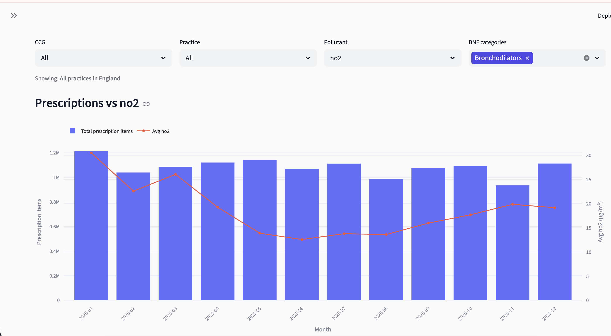
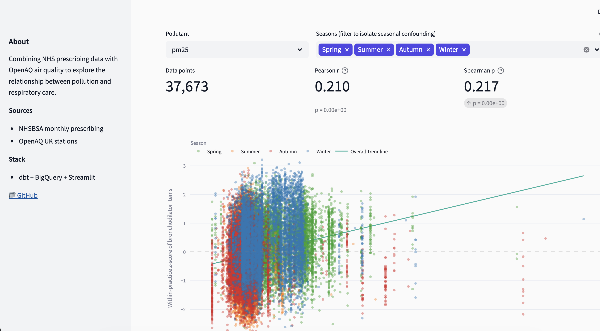
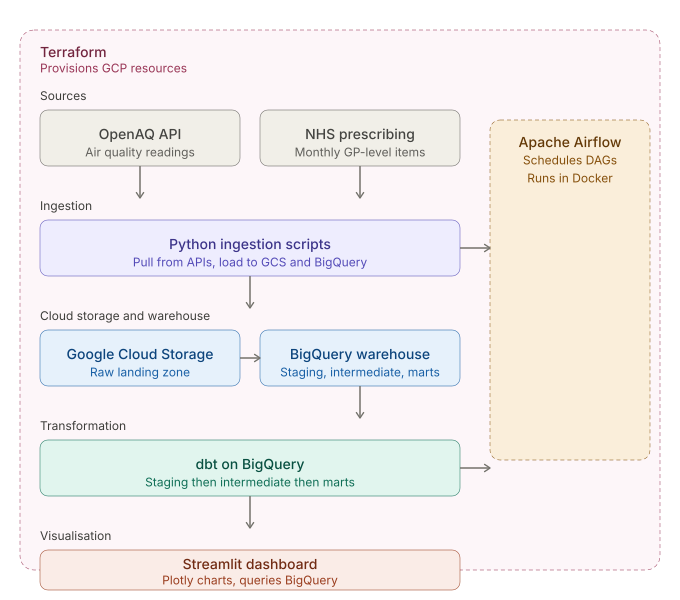

# Air Quality & Respiratory Prescribing in England

> **Data Engineering Zoomcamp 2026 - Capstone Project**

## Table of Contents
- [Problem Statement/Hypothesis](#problem-statementhypothesis)
- [Key Findings](#key-findings)
- [Dashboard](#dashboard)
- [Data Sources](#data-sources)
- [Technologies](#technologies)
- [Pipeline Architecture](#pipeline-architecture)
- [Key Assumptions](#key-assumptions)
- [Project Structure](#project-structure)
- [Reproducing This Project](#reproducing-this-project)
- [Future Improvements](#future-improvements)

## Problem Statement/Hypothesis

Does air pollution affect how many asthma inhalers are prescribed? This project builds an end-to-end data pipeline that combines **UK air quality readings** with **NHS GP prescribing data** to explore the relationship between pollution levels and respiratory medication use across England.

## Key Findings

Across all English GP practices, monthly respiratory prescribing shows a **weak
positive correlation with air pollution levels (Pearson r ≈ 0.21)**.

However this correlation shouldn't be read as a causal link:

- **Seasonality is a likely confounder.** Both pollution and respiratory
  prescribing peak in winter, so part of this correlation could be
  following a seasonal cycle rather than pollution driving
  prescribing.
- **Monthly aggregation is coarse.** Prescribing data is only published monthly,
  so air quality is aggregated to match this. A monthly average smooths out
  any short-term spikes (hours/days), likely weakening any
  real correlation.
- **Confounders are uncontrolled** - demographics, deprivation, and local
  prescribing habits possibly affect both variables.

The value of this project is the **reproducible pipeline** that makes this kind
of analysis possible, not the strength of this particular correlation.

## Dashboard

The final output is an interactive Streamlit dashboard with four views:

- **Data Overview** - headline metrics and coverage for both datasets (currently 2025 data)
- **National Trends** — monthly prescribing volumes overlaid with average pollutant levels (PM2.5, PM10, NO2) across all of England
- **Practice-Level Trends** — drill down to individual GP practices matched to air quality sensors within 10 km

**Live dashboard:** https://uk-air-quality-and-asthma.streamlit.app/


*National monthly prescribing volumes vs. pollutant levels chart*


*Correlation between air quality and respiratory prescribing at practice level for 2025*


## Data Sources

| Source | What it provides | Format | Access |
|--------|-----------------|--------|--------|
| [OpenAQ](https://openaq.org/) (via public S3 archive) | Hourly air quality readings from UK monitoring stations (PM2.5, PM10, NO2) | CSV.gz | Public S3 bucket (anonymous) |
| [OpenPrescribing](https://openprescribing.net/) (NHS BSA) | Monthly prescription items dispensed by every GP practice in England | JSON API → Parquet | Public REST API |

**BNF sections** included: Bronchodilators (0301), Corticosteroid inhalers (0302), Cromoglicate & related (0303), Systemic corticosteroids (060302).

## Technologies

| Layer | Technology | Purpose |
|-------|-----------|---------|
| Infrastructure | **Terraform** | Provisions GCS bucket (BigQuery datasets created manually - Terraform for these is a future improvement) |
| Cloud | **Google Cloud Platform** | GCS for data lake, BigQuery for data warehouse |
| Containerisation | **Docker** | Airflow stack runs in Docker Compose (scheduler, webserver, Postgres) |
| Orchestration | **Apache Airflow** | DAGs for ingestion, loading, and dbt transforms |
| Transformation | **dbt** | Staging → intermediate → mart models in BigQuery |
| Dashboard | **Streamlit** | Interactive visualisation, deployed on Streamlit Cloud |
| Language | **Python** | Ingestion scripts, Airflow tasks, Streamlit app |



## Pipeline Architecture

### 1. Ingestion (`ingest_dag`)

Runs monthly (also manually triggerable for backfills):

1. **Refresh UK stations** — fetches current station list from OpenAQ API, uploads to GCS as CSV
2. **Ingest OpenAQ** — streams CSV.gz files from the public S3 archive to GCS for all UK stations for the target month
3. **Ingest prescribing** — calls the OpenPrescribing API for each BNF section, saves as Parquet to GCS

### 2. Loading & transformation (`transform_dag`)

Triggered after ingestion completes:

1. **Load to BigQuery** — four parallel tasks load raw data from GCS into BigQuery (`openaq_measurements`, `prescribing`, `practice_locations`, `uk_stations`), with idempotent month-level deletes before appending
2. **dbt run** — rebuilds all models

### 3. dbt model layers

```
raw (BigQuery)
  └── staging (views)
        ├── stg_openaq_measurements    — timestamps, pollutant names, data quality flags
        ├── stg_prescribing            — rename columns, flag negatives/incomplete records
        ├── stg_practice_locations     — clean coordinates
        └── stg_locations              — sensor metadata
  └── intermediate (tables)
        ├── int_monthly_air_quality        — aggregate daily readings → monthly averages per station/pollutant
        ├── int_gp_respiratory_prescribing — filter respiratory prescriptions (BNF section 03) with quality checks
        └── int_practice_sensor_lookup     — spatial join: match GP practices to sensors within 10 km (Haversine)
  └── marts (tables)
        ├── mart_prescribing_air_quality      — fact table joining prescribing to air quality by practice/month
        ├── mart_practice_monthly_correlation — standardised z-scores for practice-level correlation analysis
        ├── mart_national_monthly_air_quality — national monthly averages by pollutant
        ├── mart_national_monthly_prescribing — national monthly totals by BNF label
        ├── mart_dashboard_overview           — summary statistics and data coverage metrics
        ├── mart_overview_aq_coverage         — station data coverage by number of months
        ├── mart_overview_aq_pollutant        — reading counts and station counts per pollutant
        ├── mart_overview_rx_bnf              — prescription totals by drug type (BNF label)
        └── mart_overview_rx_monthly          — monthly prescription volume trends
```

### 4. Data warehouse

BigQuery datasets:

| Dataset | Contents |
|---------|----------|
| `raw` | Source tables loaded from GCS |
| `air_quality_asthma_staging` | dbt staging views |
| `air_quality_asthma_intermediate` | dbt intermediate tables |
| `air_quality_asthma_marts` | Final mart table |

The `openaq_measurements` table is **partitioned by month** on the `datetime` column. The `prescribing` table is **partitioned by month** on `period_date`. This keeps query costs low when filtering by date range.

## Key Assumptions

- **10 km proximity** — a GP practice is matched to all air quality sensors within 10 km. Readings from multiple sensors are averaged. This is a coarse proxy for patient-level pollution exposure.
- **Monthly granularity** — both prescribing and air quality are aggregated to monthly level before joining.
- **England only** — prescribing data covers England; air quality stations are filtered to Great Britain (GB).
- **Correlation, not causation** — this pipeline enables exploration of trends, not causal inference. Many confounding factors (demographics, seasonality, deprivation) are not controlled for.

## Project Structure

```
.
├── dbt/                        # dbt project
│   ├── models/
│   │   ├── staging/            # Source cleaning & flagging
│   │   ├── intermediate/       # Monthly aggregation & spatial join
│   │   └── marts/              # Final joined fact table
│   ├── dbt_project.yml
│   └── profiles.yml
├── orchestration/              # Airflow
│   ├── dags/                   # Ingestion and transform DAGs
│   ├── Dockerfile
│   └── docker-compose.yml
├── scripts/
│   └── backfill.py             # CLI for backfilling historical months
├── streamlit_app/
│   └── app.py                  # Dashboard
├── terraform/                  # GCS bucket provisioning
│   ├── main.tf
│   └── variables.tf
└── exploration/                # Ad-hoc exploration scripts (not part of pipeline)
```

## Reproducing This Project

### Prerequisites

- **GCP account** with a project and billing enabled
- **gcloud CLI** authenticated (`gcloud auth application-default login`)
- **Terraform** installed
- **Docker** and Docker Compose
- **Python 3.13+** and [uv](https://docs.astral.sh/uv/) (for local Streamlit)
- **OpenAQ API key** (free — register at [openaq.org](https://openaq.org/))

### 1. Clone and set up

```bash
git clone https://github.com/<your-username>/AIrQuality_Health_Project.git
cd AIrQuality_Health_Project
```

### 2. Provision infrastructure

```bash
cd terraform
cp terraform.tfvars.example terraform.tfvars  # add your GCP project ID
terraform init
terraform apply
```

> **Note:** Terraform provisions the GCS bucket. BigQuery datasets (`raw`, `air_quality_asthma_staging`, `air_quality_asthma_intermediate`, `air_quality_asthma_marts`) need to be created manually in the GCP console (EU region). Automating this with Terraform is a planned improvement.

### 3. Start Airflow

```bash
cd orchestration

# Create .env with your settings:
# GOOGLE_CLOUD_PROJECT=your-project-id
# OPENAQ_API_KEY=your-api-key

docker compose up -d
```

Airflow UI will be at `http://localhost:8080` (admin/admin).

### 4. Load practice locations (one-time)

```bash
docker compose exec airflow-scheduler \
  airflow tasks test practice_locations_dag fetch_practice_locations 2025-01-01
docker compose exec airflow-scheduler \
  airflow tasks test transform_dag load_practice_locations_to_bq 2025-01-01
```

### 5. Backfill historical data

The backfill script ingests data for a range of months into GCS via Airflow tasks:

```bash
# From the project root:
python scripts/backfill.py --start 2025-01 --end 2025-06
```

Then load each month into BigQuery and run dbt:

```bash
cd orchestration

# Load each month into BigQuery (repeat for each month)
docker compose exec airflow-scheduler \
  airflow tasks test transform_dag load_openaq_to_bq 2025-01-01
docker compose exec airflow-scheduler \
  airflow tasks test transform_dag load_prescribing_to_bq 2025-01-01
# ... repeat for 2025-02-01 through 2025-06-01

# Rebuild dbt models
docker compose exec airflow-scheduler \
  airflow tasks test transform_dag run_dbt 2025-01-01
```

> **Note:** The BigQuery loading step is currently run per-month manually. A future improvement would be a single backfill command that handles both GCS ingestion and BigQuery loading end-to-end.

### 6. Run the dashboard locally

```bash
uv sync
uv run streamlit run streamlit_app/app.py
```

## Future Improvements

- Automate BigQuery dataset creation with Terraform
- Single backfill command that covers both GCS ingestion and BigQuery loading
- Add dbt tests and schema documentation for the mart layer
- Include demographic/deprivation data as confounding variables